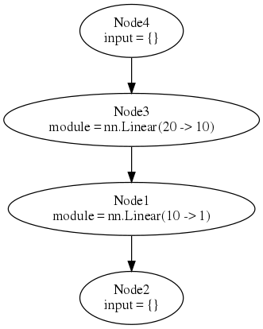
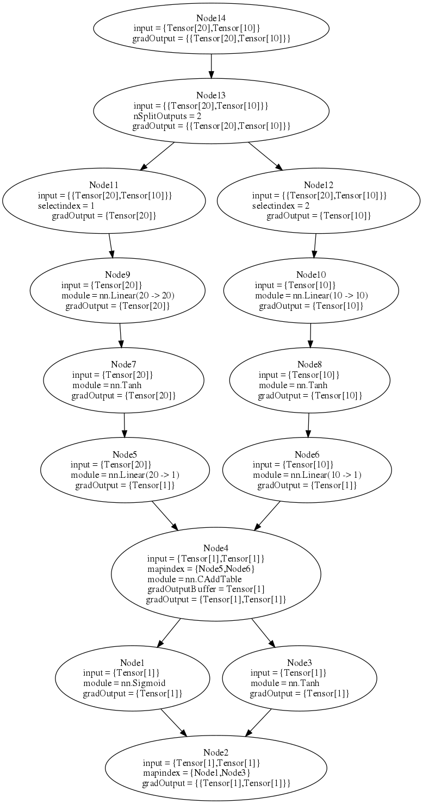

The Long way of Deep Learning with Torch: part 11
============
**Abstract:** In this post we analyze [nngraph](https://github.com/torch/nngraph) library to easily build complex neural networks.

The [nngraph](https://github.com/torch/nngraph) library provide tools to create complicated architecture in a "graphical manner".

##Install
You can install `nngraph` with

```
$ luarocks install nngraph
```

As an optional dependecy you can install `graphviz`, if you have it you will be able to display the graph that you have created. For installing the package run the appropriate command below:

```zsh
# Mac users
$ brew install graphviz

# Debian/Ubuntu users
$ sudo apt-get install graphviz -y

#ArchLinux
$ sudo pacman -S graphviz
```


**NB:** please use the [offical graphviz installer](http://www.graphviz.org/Download_macos.php) instead of `brew` otherwise you cannot be able to use it with `nngraph`.

##Basic Concepts
Let's briefly recap some `nn` [Torch](https://github.com/torch/torch7/blob/master/README.md) basic concepts. There are two fondamental pieces to build neural networks (from now on simply called `nn`) : [modules](deep_learning_with_torch_step_1_nn_module.md) and [containers](deep_learning_with_torch_step_2_nn_containers.md):

- The first is an abstraction of an `nn` layer. It can peform either forward pass (taking an input and generates an output), and backward pass that performs a backpropagation step. 
- The latter is used to combine in some way other `modules` to build complex `nn`.
 
 
## NNGraph

Any `Module` can be wrapped in a `nngraph.Node`.

```lua
th> nn.Identity() -- this create an identity module
nn.Identity

th> nn.Identity()() -- this create an identity module and wraps it in a node
nngraph.Node
```
The `nngraph` library provide a way to build any conplex network focusing on the network graph and avoiding the use of `containers`.
`nngraph` overloads the `__call__` operator (i.e. the () operator used for function calls) on all `nn.Module` objects. By executing the `__call__` operator it is returned a node wrapping a `nn.Module`.

```lua
h1 = nn.Linear(20, 10)()
h2 = nn.Linear(10, 1)(h1)
mlp = nn.gModule({h1},{h2})
```


The call operator takes the parents of the node as arguments, which specify which modules will feed into this one during a forward pass.

##Examples

### Example 1

```lua
h1 = nn.Linear(20, 10)()
h2 = nn.Linear(10, 1)(h1)
model = nn.gModule({h1},{h2})
```

This image above describes a multi layer perceptron with 2 hidden layers. The first layer `h1`  is a Linear transformation from 20 to 10. The second layer gets an input of size 10 and an output of size 1 and takes as input the layer `h1`. This means that there is an edge the goes out from `h1` and enters into `h2`.

Finally we make `model` calling `nn.gModule` with `h1` and `h2` as parameters. `nn.gModule` takes 2 input: a `table` of `nodes` that are the inputs of the `nn` and  a `table` of outpus `nodes`.

Using `graphviz` we can plot the neural network in in the example above.

```lua
require 'nngraph'

-- draw graph (the forward graph, '.fg'), use it with itorch notebook
graph.dot(model.fg, 'MLP')
-- or save graph to file MLP.svg and MLP.dot
graph.dot(model.fg, 'MLP', 'MLP')
```


The first and last nodes are *dummy nodes* and regroup all inputs and outputs of the graph. The `module` entry describes the function of the node, as applies to `input`, and producing a result of the shape `gradOutput`; `mapindex` contains pointers to the parent nodes.

### Example 2

This is a simple example but you can create arbitrarily complex networks with the same semplicity.

As example we can create a `module` that takes 2 inputs and 2 outputs

```lua
require 'nngraph'

h1 = nn.Linear(20, 20)()
h2 = nn.Linear(10, 10)()
hh1 = nn.Linear(20, 1)(nn.Tanh()(h1))
hh2 = nn.Linear(10, 1)(nn.Tanh()(h2))
madd = nn.CAddTable()({hh1, hh2})
oA = nn.Sigmoid()(madd)
oB = nn.Tanh()(madd)
gmod = nn.gModule({h1, h2}, {oA, oB})

x1 = torch.rand(20)
x2 = torch.rand(10)

gmod:updateOutput({x1, x2})
gmod:updateGradInput({x1, x2}, {torch.rand(1), torch.rand(1)})
graph.dot(gmod.fg, 'Big MLP')
```


