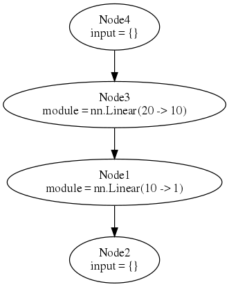
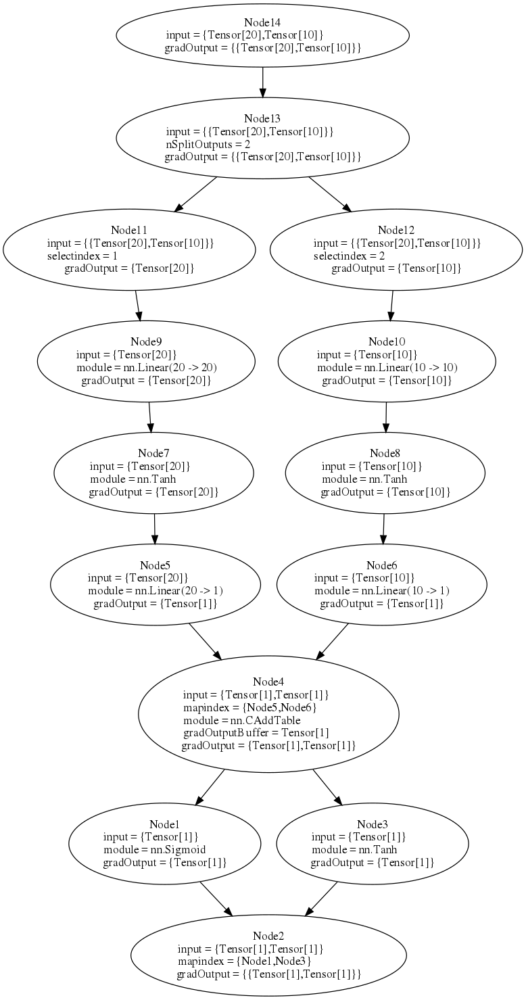

The Long path to Deep Learning using Torch: part 6
============
**Abstract:** In this post we analyze [nngraph](https://github.com/torch/nngraph) library to easily build complex neural networks.

The [nngraph](https://github.com/torch/nngraph) library provide tools to create complicated architecture in a "graphical manner".

##Install
You can install `nngraph` with
```
$ luarocks install nngraph
```

As an optional dependecy you can install `graphviz`, if you have it you will be able to display the graph that you have created. For installing the package run the appropriate command below:
```zsh
# Mac users
$ brew install graphviz

# Debian/Ubuntu users
$ sudo apt-get install graphviz -y

#ArchLinux
$ sudo pacman -S graphviz
```


**NB:** please use the [offical graphviz installer](http://www.graphviz.org/Download_macos.php) instead of `brew` otherwise you cannot be able to use it with `nngraph`.

##Basic Concepts
Let's briefly recap some `nn` [Torch](https://github.com/torch/torch7/blob/master/README.md) basic concepts. There are two fondamental pieces to build neural networks (from now on simply called `nn`): [modules](deep_learning_with_torch_step_1_nn_module.md) and [containers](deep_learning_with_torch_step_2_nn_containers.md).
The first is an abstraction of an `nn` layer and as such, it can peform either forward pass, taking an input and transforming it somehow to generate an output, and backward pass, that performs a backpropagation step.
The latter is used to combine in some way other `modules` to build complex `nn`. Actually a container is a `module` so, like any other `modules`, it can perfom fowrad an backward steps but unlike `simple modules` its behavior is mainly defined by the `modules` of which it is composed.

Every network is a graph, and `nn` are too. The `nngraph` library provide a way to build any conplex network focusing on the network graph and avoiding the use of `containers`.

Any given `module` can be wrapped in a node.

```lua
th> nn.Identity() -- this create an identity module
nn.Identity

th> nn.Identity()() -- this create an identity module and wraps it in a node
nngraph.Node
```

The `nngraph` overloads the `__call__` operator (i.e. the () operator used for function calls) on all `nn.Module` objects.
When the `__call__` operator is invoked, it returns a node wrapping the `nn.Module`.
The call operator takes the parents of the node as arguments, which specify which modules will feed into this one during a forward pass.

##Examples
Let's see a simple example.

```lua
h1 = nn.Linear(20, 10)()
h2 = nn.Linear(10, 1)(h1)
mlp = nn.gModule({h1},{h2})
```

This is a multi layer perceptron with 2 hidden layers, the first layer `h1` takes an input of size 20 and make an output of sie 10.
The second layer gets an input of size 10 and an output of size 1.
Furthermore we pass `h1` to the `__call__` operetor of `h2`, this means that there is an edge the goes out from `h1` and enters into `h2`.
In other words the output of `h1` is the input of `h2` (`h1` will feed `h2`).
As you can se `h1` has no in edge.

Finally we make `mlp` that is an `nn.gModule` that extends `nn.module`. That is, it can do everything a `module` can do, for example forward and backward passes.

`nn.gModule` takes 2 input, the first is a `table` of `nodes` that are the inputs of the `nn` and the second is a `table` of outpus `nodes`.

If you have installed `graphviz`, you can display the graph that you have created.

```lua
-- draw graph (the forward graph, '.fg'), use it with itorch notebook
graph.dot(mlp.fg, 'MLP')
-- or save graph to file MLP.svg and MLP.dot
graph.dot(mlp.fg, 'MLP', 'MLP')
```


Read this diagram from top to bottom, with the first and last nodes being *dummy* nodes that regroup all inputs and outputs of the graph. 
The `module` entry describes the function of the node, as applies to `input`, and producing a result of the shape `gradOutput`; `mapindex` contains pointers to the parent nodes.

This is a simple example but you can create arbitrarily complex networks with the same semplicity.

As example we can create a `module` that takes 2 inputs and 2 outputs
```lua
h1 = nn.Linear(20, 20)()
h2 = nn.Linear(10, 10)()
hh1 = nn.Linear(20, 1)(nn.Tanh()(h1))
hh2 = nn.Linear(10, 1)(nn.Tanh()(h2))
madd = nn.CAddTable()({hh1, hh2})
oA = nn.Sigmoid()(madd)
oB = nn.Tanh()(madd)
gmod = nn.gModule({h1, h2}, {oA, oB})

x1 = torch.rand(20)
x2 = torch.rand(10)

gmod:updateOutput({x1, x2})
gmod:updateGradInput({x1, x2}, {torch.rand(1), torch.rand(1)})
graph.dot(gmod.fg, 'Big MLP')
```


